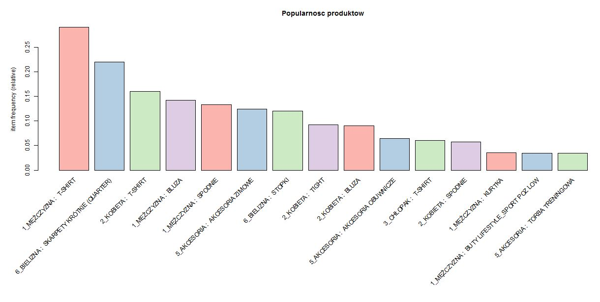
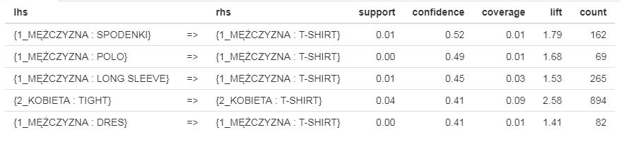
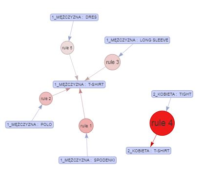

# analiza_koszykowa

Aplikacja to narzędzie służące do przeprowadzenia analizy koszykowej w sieci sklepow detalicznych za dowolny okres.

Aplikacja dostepna jest w ponizszej lokalizacji [link](https://tararuj4.shinyapps.io/Analiza_Koszykowa/?_ga=2.80249746.4648736.1640269735-1531846937.1640269735).

Oprócz aplikacji w folderze znajduje się skrypt służący do przetworzenia specyficznych danych z pewnego przedsiebiorstwa do formatu potrzebnego do uruchomienia skryptu
&nbsp;

W celu uruchomienia algorytmu należy:
- załadować dane paragonowe w poniższej formie:  
(W zbiorze powinny znaleźć sie jedynie paragony z conajmniej dwoma produktami),

| Data       | NrParagonu | Nazwa Produktu |
|------------|------------|----------------|
| 2021-01-02 | XXX_11     | SPODNIE        |
| 2021-01-02 | XXX_11     | SPODNIE        |
| 2021-01-02 | XXX_12     | BIELIZNA       |

- kliknąć w przycisk "Oblicz",
- wybrać interesujący nas zakres dat,
- ustawić parametry tworzenia reguł, tj. support (minimalny poziom wsparcia reguły) oraz confidence (prawdopodobieństwo dobrania danego produktu jak drugą szt.),
- ustawić ile reguł wyświetlać,
- ustawić w jaki sposób sortować reguły (czy po poziomie confidence, support, czy lift),
- kliknąć w przycisk "Wyswietl" (Każdorazowo po dokonaniu zmian w ustawieniach).

    Możemy również obserwować reguły wyłącznie dla zadeklarowanego produktu lub dla wszystkich ("IGNORUJ")

&nbsp;

Opis zakładek:

- Reguły: w tym oknie po poprawnym wprowadzeniu danych pojawią nam odfiltrowane reguły w formie tabeli lub wykresu,
- Wykres czestosci: prezentuje najczęściej występujące w paragonach produkty w ujęciu względnym (procentowym),
- Podsumowanie zbioru: krótka charakterystyka danych zaczytanych do modelu,
- Objasnienia: Słowniczek pojęć i terminów wykorzystanych w aplikacji.

&nbsp;

W celu sprawdzenia narzędzia można skorzystać z załączonych danych surowych w pliku: "przykladowe_dane.csv", są to losowo przygotowane dane dla potrzeb prezentacji.

Poniżej przykładowe (wygenerowane w sposób losowy) dane jakie uzyskujemy:

a) wykres częstości danego asortymentu we wszystkich paragonach spełniających kryterium analizy (tj. gdzie sa min. 2 transakcje)  

 

b) zestawienie kilku przykladowych reguł

 

c) wykres prezentujący głowne reguly, które wyklarowały się podczas analizy. 
 

---
Dzieki takiej wiedzy moze podejmowac świadome decyzje o:
- kszatłcie promocji (jaki produkt ze soba łaczyc),
- sposobie ekspozycji produktów na sklepach,
- szkoleniu sprzedawców, w celu maksymalizacji koszyka zakupowego.
